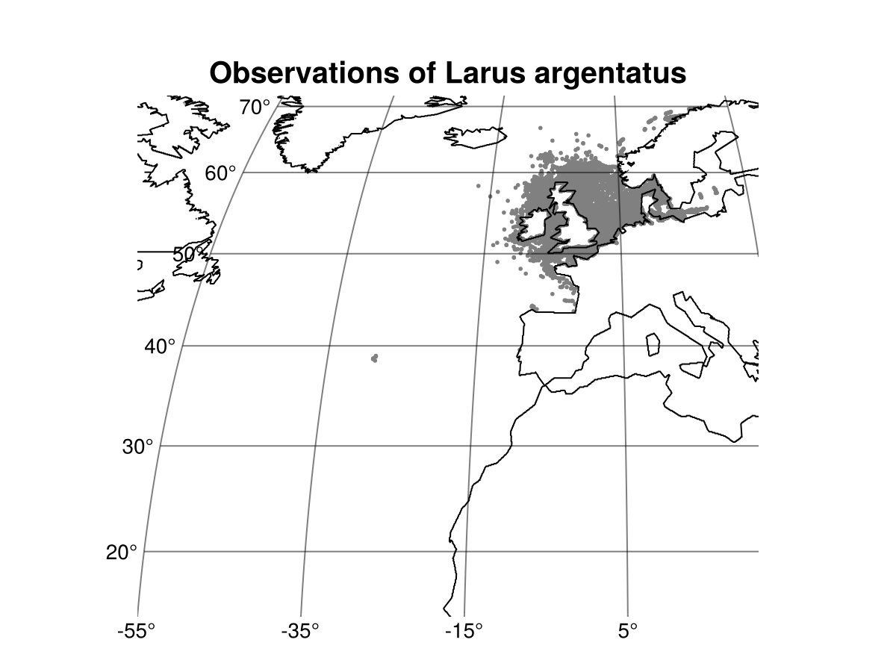
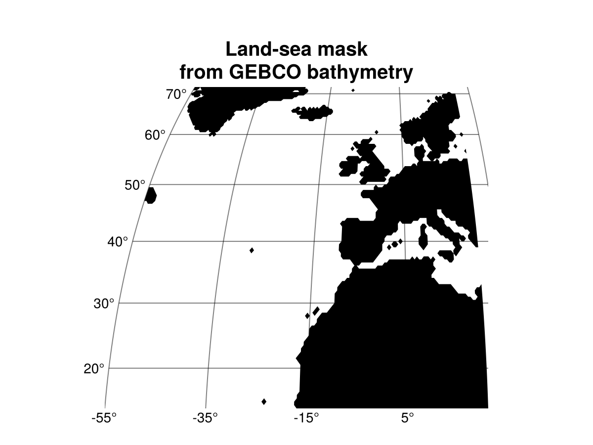
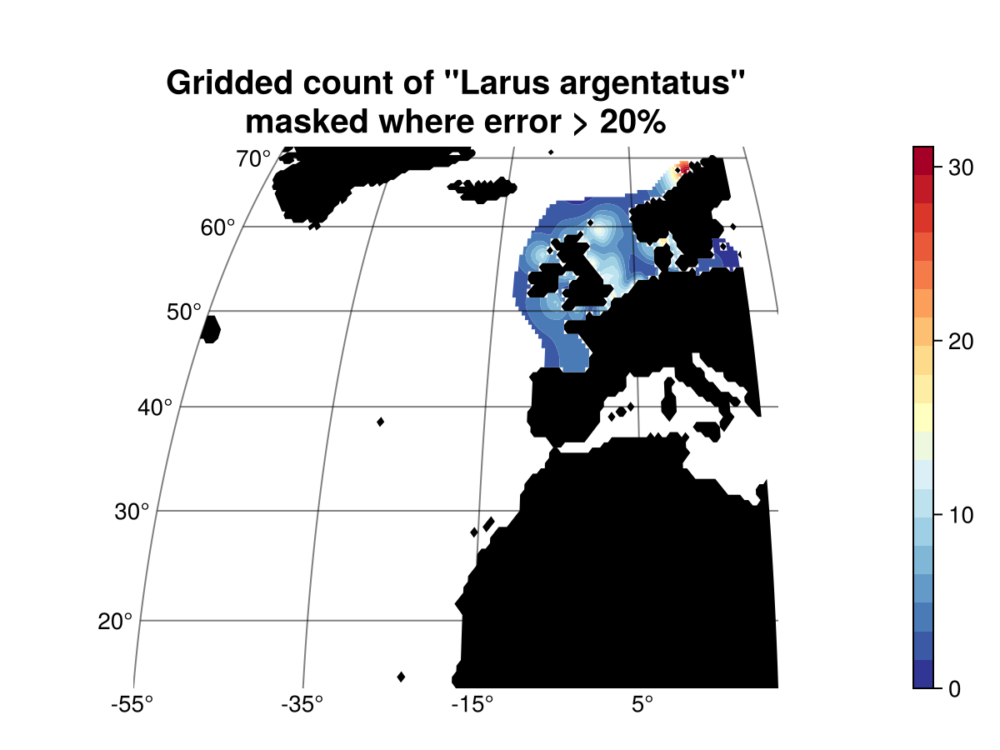

# EMODnet-Biology-Interpolation-SeaBirds

[](https://www.repostatus.org/#active)

[](https://doi.org/10.5281/zenodo.15174401)

[`DIVAnd`](https://github.com/gher-uliege/DIVAnd.jl) is a software tool designed to generate gridded maps of continuous variables such as sea water temperature, salinity or oxygen concentration. The acronyms stands for _Data Interpolating Variational Analysis in n dimensions_.

 The main advantages of `DIVAnd` with respect to other interpolation methods are:
* coastlines and physical boundaries are taken into account by the method.
* large datasets (million of data points) can be ingested and processed by the tool.

`DIVAnd` is a multi-dimensional generalization ([Barth et al., 2014](https://dx.doi.org/10.5194/gmd-7-225-2014)), written in the [Julia language](https://julialang.org/), with a new mathematical formulation with respect to the previous [`DIVA`](https://github.com/gher-ulg/DIVA) code.

This directory provides the codes and tools to
1. prepare the gridded fields for a list of sea birds (file [`create_bird_products.jl`](scrips/create_bird_products.jl));
2. provide a graphical interface (in [`Pluto`](https://plutojl.org/)) to generate gridded field of sea birds abundance (file [`interp_birds_pluto.jl`](scrips/interp_birds_pluto.jl)).

## Directory structure

```
EMODnet-Biology-Interpolation-SeaBirds/
├── data/
│   ├── derived_data/
│   └── raw_data/
├── docs/
├── product/
│   ├── maps/
│   ├── netcdf/
│   └── plots/
└── scripts/
```

* **data** - Raw and derived data
* **docs** - Rendered reports
* **product** - Output product files
* **scripts** - Reusable code


## Data input

This data product use the following dataset:

> Vanermen N, Stienen EWM, Fijn R, Markones N, Holdsworth N, Osypchuk A, Pinto C, Desmet P (2022): European Seabirds at Sea (ESAS). ICES, Copenhagen, Denmark. https://esas.ices.dk. https://doi.org/10.14284/601

The raw files are obtained from VLIZ at https://www.vliz.be/en/imis?module=dataset&dasid=3117



The GEBCO topography is also required to create the land-sea mask used in `DIVAnd`:
> GEBCO Bathymetric Compilation Group 2024 The GEBCO_2024 Grid - a continuous terrain model of the global oceans and land. NERC EDS British Oceanographic Data Centre NOC, 2024. https://doi.org/10.5285/1c44ce99-0a0d-5f4f-e063-7086abc0ea0f




## Data product

The data product consists of a netCDF file containing the gridded field obtained by the interpolation of the observations of more than 400 sea bird species. The field is computed for 5 time periods: 1970-1979, 1980-1980, 1990-1999, 2000-2009 and 2010-2019.

Along with the gridded field, an error field is also provided. It allows user to only consider the regions where the analysis can be trusted, i.e. where the error field is lower than a given threshold (0.25 for example).

The `aphiaID` and the scientific name of the different species are also stored as variables in the netCDF.

