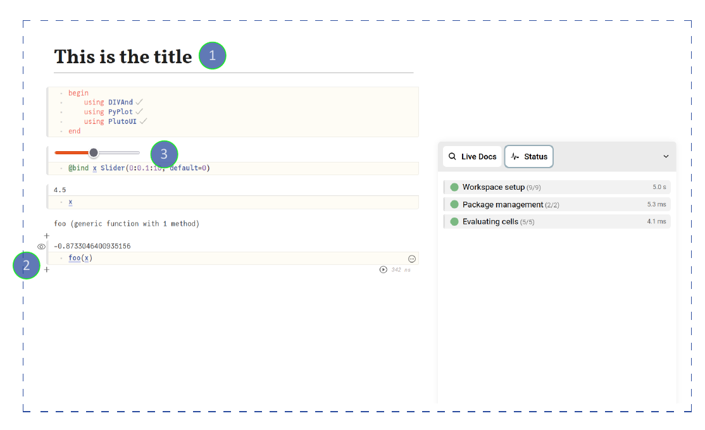
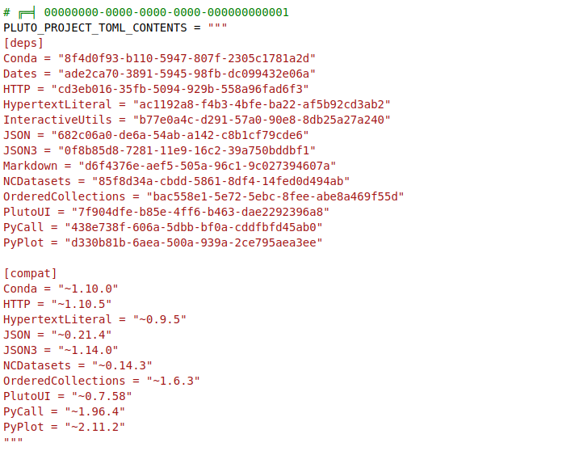
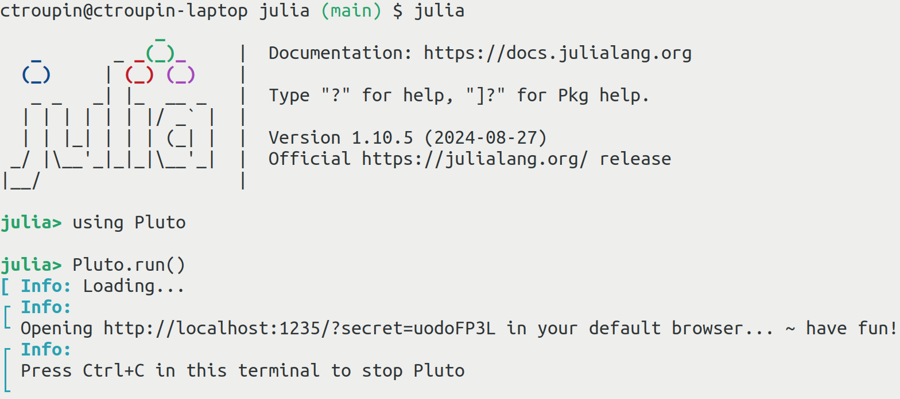
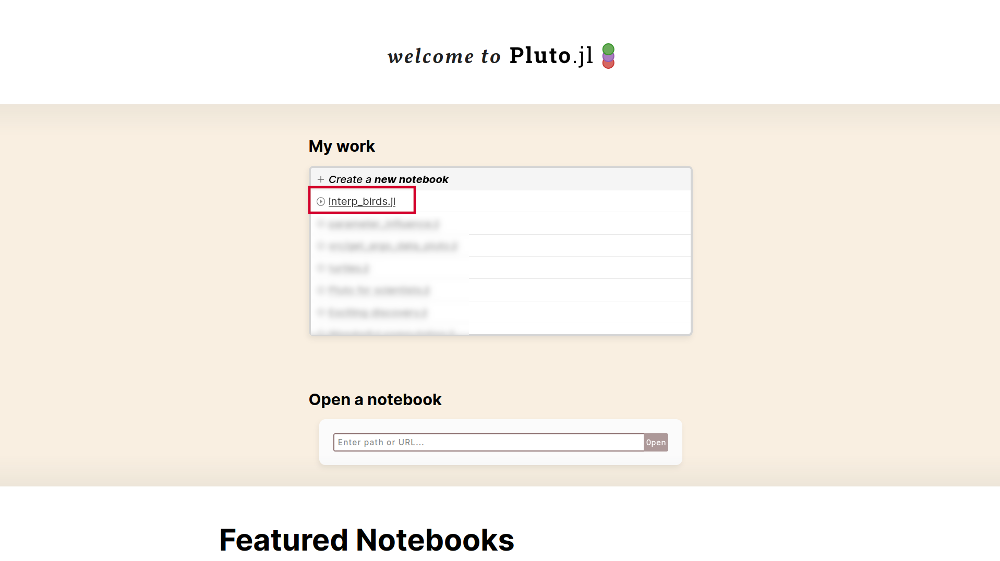
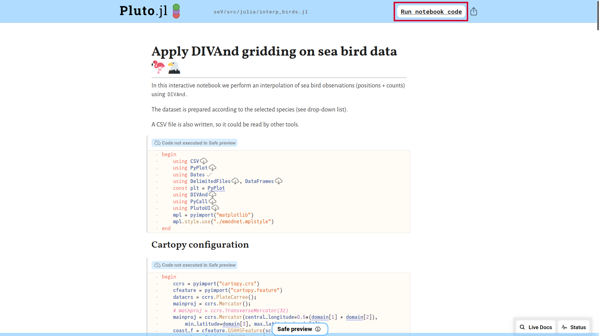
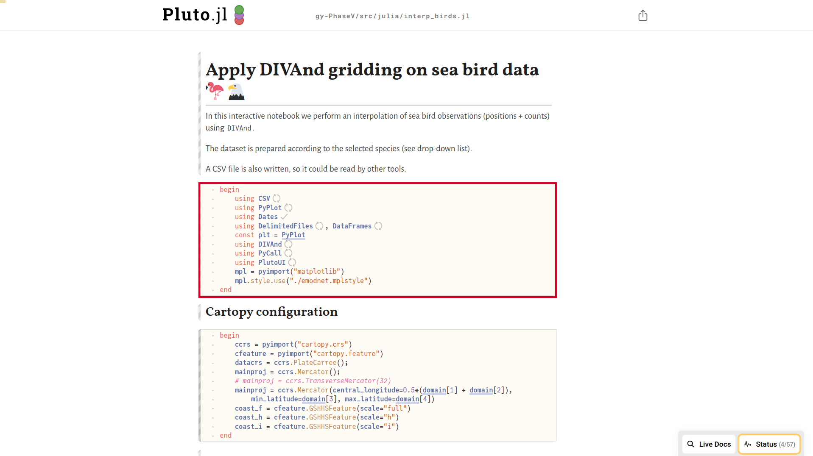
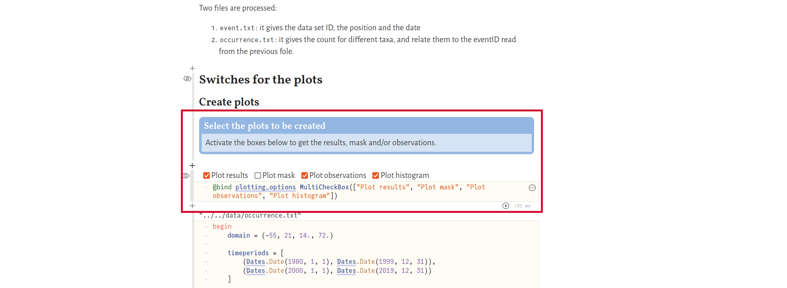
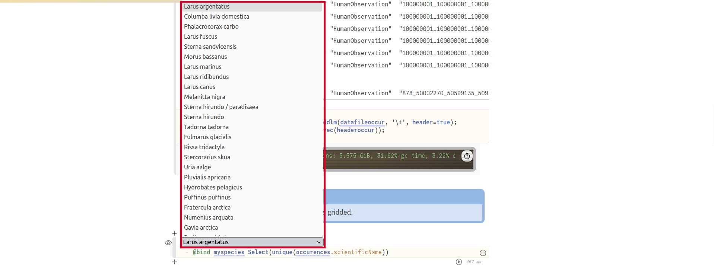
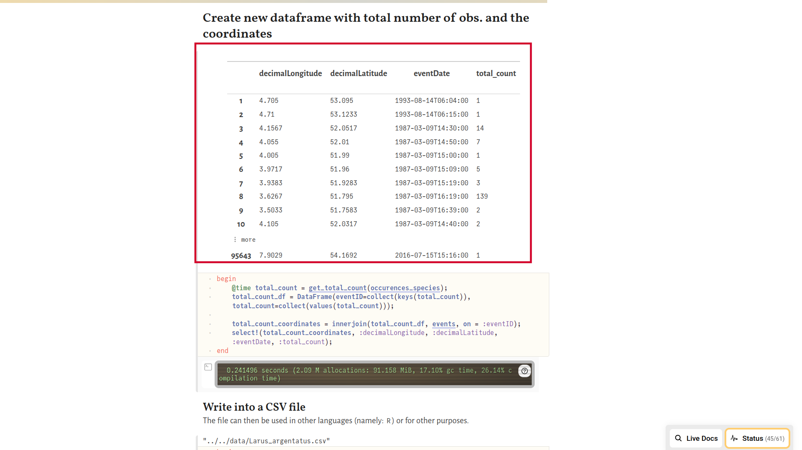
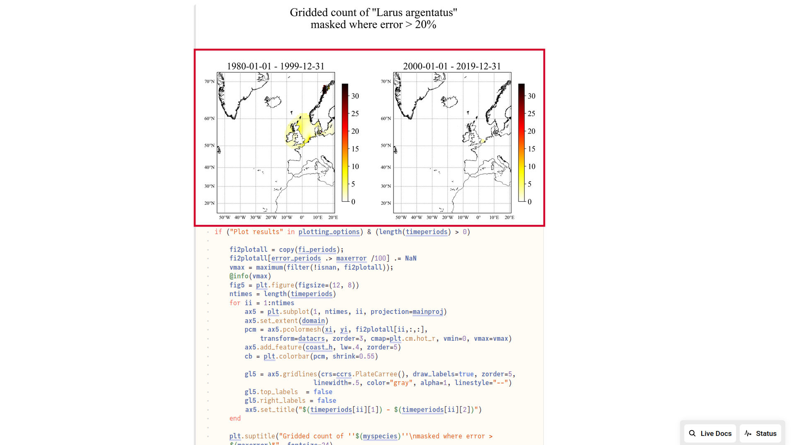

# EMODnet Biology: interpolation of bird observations with DIVAnd
---
##  Julia and Pluto

### What is Julia?

[Julia](https://julialang.org/) is a 
- fast
- dynamic
- high-level and 
- open source
programming language.

It was created in 2012 (and used at GHER-ULiège since 2017).


### What is Pluto?

[Pluto](https://plutojl.org/) is a 
- reactive
- lightweight
- simple and 
- reproducible
notebook environment.

It was created in 2020 (and used at GHER since 2022).


### Pluto vs. Jupyter

| Jupyter    | Pluto |
| -------- | ------- |
| Many kernels (languages) available  | Julia only    |
| JSON format | Julia script     |
| State depending on the order of execution | State updated everytime a cell is modified |
|       |  Interactive |

## Pluto notebooks


### Anatomy of a Pluto notebook



1.  Made up of cells: code, markdown, HTML, ...
2.  Cell visibility can be turned off
3.  Interactivity (https://featured.plutojl.org/basic/plutoui.jl)
4.  Reproducibility

### Reproducibility!


All the
- package versions (numbers etc)
- compatibility constraints
are stored in the Julia file     
(not visible in the web interface).

## Application: creating gridded maps for birds

### Start a Pluto session

Start Julia and type
```julia
using Pluto
Pluto.run()
```


### Select the file to be opened


### Click on "Run notebook code"


The first execution can take a while, since the packages have to be compiled.



### Set the user inputs
1. Types of plots: by default, no plots are created; by enabling the plots, they are displayed on screen and also saved in the `product/plots` directory.
2. Region of interest (where the interpolation is performed): defined in the variable `domain` (west, east, south, north).
3. Periods of interest: the gridding can be performed on different time periods (more than 2) so that comparison can be carried out.


### Select the species of interest in the drop-down list 


A _data frame_ containing the osbervations for the species will be created.


### Select the maximal allowed error

Analysed and error field are automatically generated.         
For the figure, only the field with an error lower than a given threshold is displayed.


### Compare the time periods

Separate analysis are performed for the time periods specified at the beginning of the notebook.

