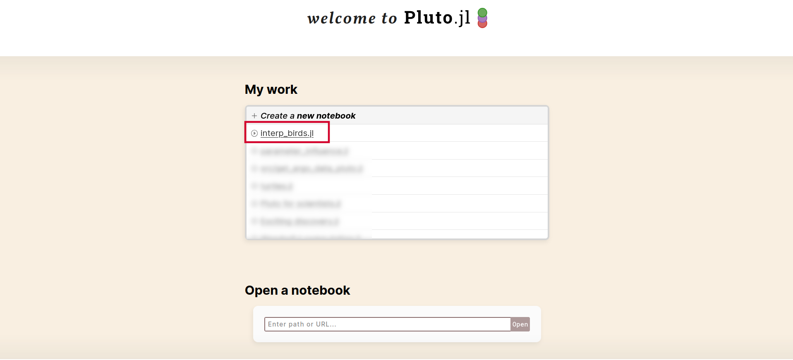
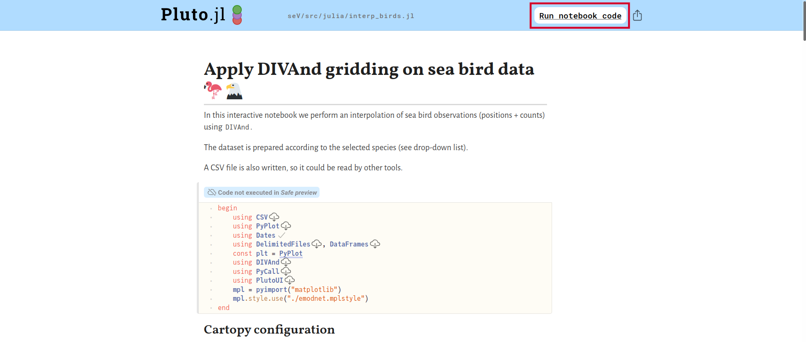
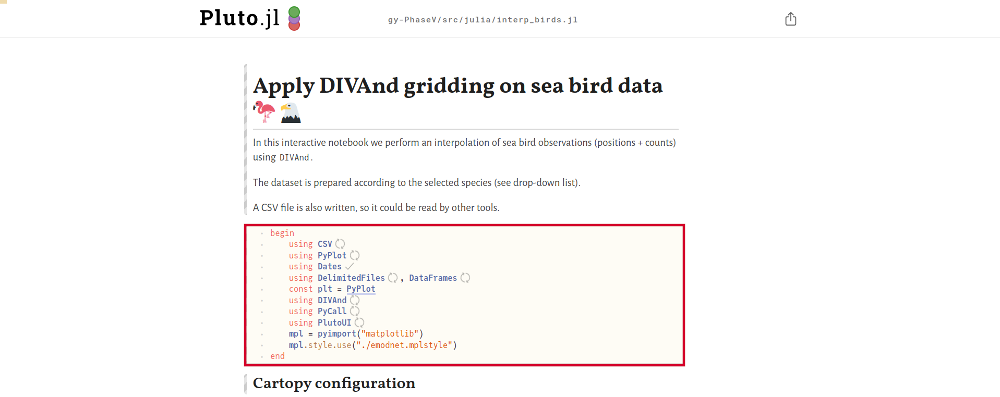
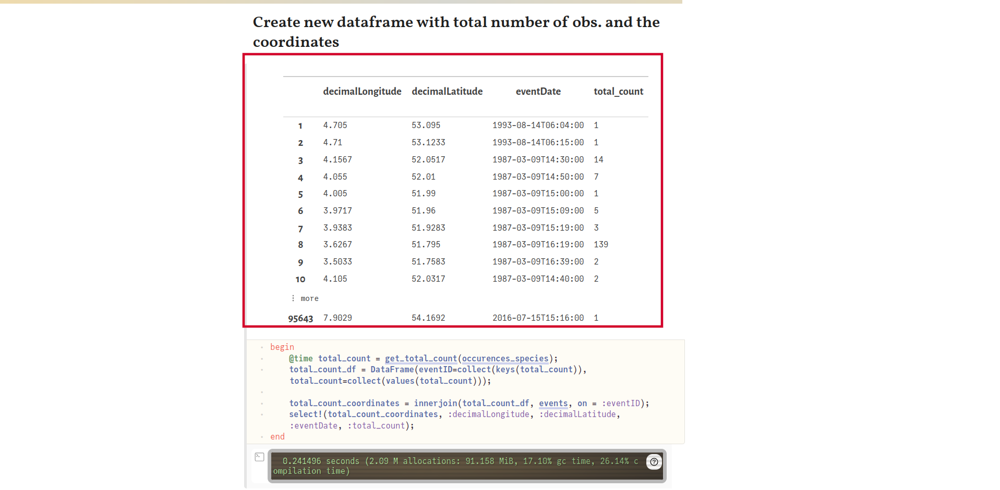
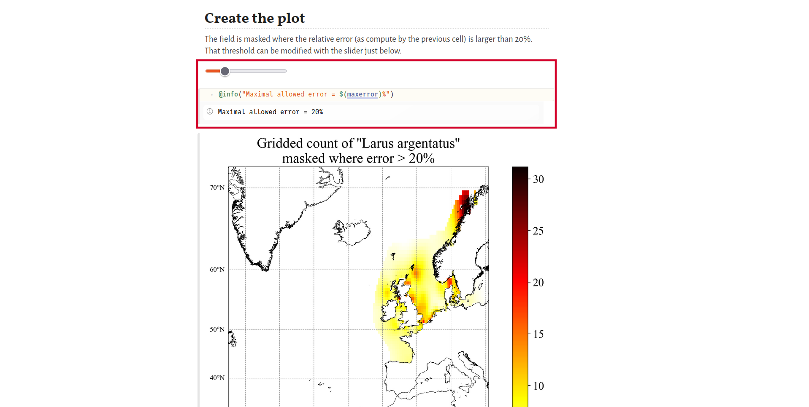
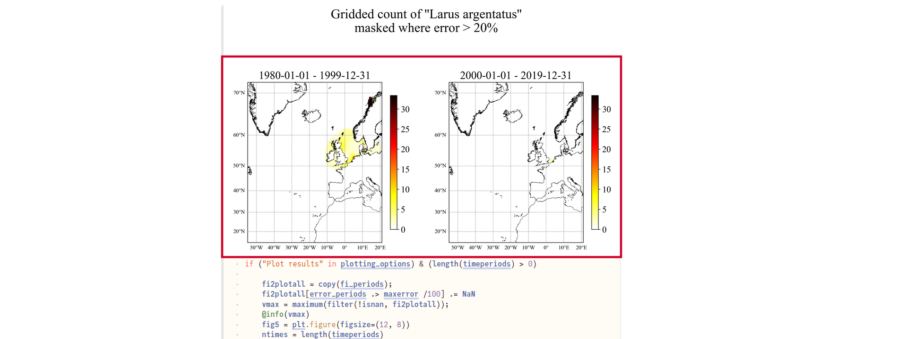

# EMODnet Biology: interpolation of bird observations with DIVAnd
---
##  Julia and Pluto

### What is Julia?

[Julia](https://julialang.org/) is a 
- fast
- dynamic
- high-level and 
- open source
programming language.

It was created in 2012 (and used at GHER-ULiège since 2017).


### What is Pluto?

[Pluto](https://plutojl.org/) is a 
- reactive
- lightweight
- simple and 
- reproducible
notebook environment.

It was created in 2020 (and used at GHER since 2022).


### Pluto vs. Jupyter

| Jupyter    | Pluto |
| -------- | ------- |
| Many kernels (languages) available  | Julia only    |
| JSON format | Julia script     |
| State depending on the order of execution | State updated everytime a cell is modified |
|       |  Interactive |

## Pluto notebooks


### Anatomy of a Pluto notebook


1.  Made up of cells: code, markdown, HTML, ...
2.  Cell visibility can be turned off
3.  Interactivity (https://featured.plutojl.org/basic/plutoui.jl)
4.  Reproducibility

### Reproducibility!


All the
- package versions (numbers etc)
- compatibility constraints
are stored in the Julia file     
(not visible in the web interface).

## Application: creating gridded maps for birds

### Start a Pluto session

Start Julia and type
```julia
using Pluto
Pluto.run()
```


### Select the file to be opened


### Click on "Run notebook code"


The first execution can take a while, since the packages have to be compiled.



### Select the types of plot you want to generate
By default, no plots are created.    
By enabling the plots, they are displayed on screen and also saved in the `product/plots` directory.


### Select the species of interest in the drop-down list 


### 

### 

### 

### 
